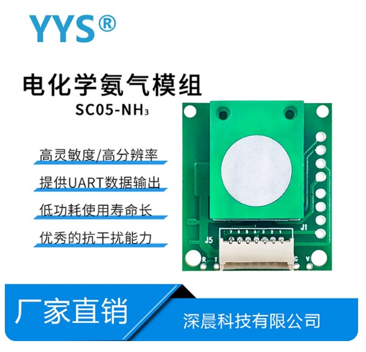

**Language:** [English](README.md) | [中文](README.zh-CN.md)

# Shenchen SC05-NH3 · Electrochemical NH₃ Module Driver

**Vendor:** Shenzhen Shenchen Technology Co., Ltd  
**Model:** SC05-NH3  
**Type:** Electrochemical ammonia (NH₃), UART auto-upload  

Platform-independent C driver for the Shenchen **SC05-NH3** electrochemical ammonia module.



*SC05-NH3 electrochemical NH₃ module · Shenchen Technology*

---

## Features

- Platform-independent: UART/time injected via `sensor_io_t`, no MCU HAL dependency
- Auto-upload module: just call `get()` and read the result — no commands to send
- Concentration is delivered as `float` PPM (`conc_ppm` / `range_ppm`)
- 60s warm-up checked **after** a successful parse (`NH3_ERR_WARMUP`)
- Return codes: `0` OK, `1` no frame / bad args, `2` warming up; `out` written only on OK

## IO interface you must implement

The driver never touches the HAL. It only uses three function pointers you inject at `init` (see `src/sensor.h`):

```c
typedef struct sensor_io {
    /* Read UART: non-blocking; return bytes actually read; 0 = no data now */
    uint32_t (*read)(uint8_t *buf, uint32_t len);

    /* Write UART: this module is upload-only — may be NULL */
    uint32_t (*write)(const uint8_t *buf, uint32_t len);

    /* Millisecond tick: required; used for timeout & warm-up */
    uint32_t (*now_ms)(void);
} sensor_io_t;
```

Rules:

1. **`read` / `write` must be non-blocking** — never `delay` or wait for TX complete inside them; return 0 when empty, the driver retries until its deadline.
2. **`now_ms` returns ms since boot** (wrap-around is OK); warm-up and `wait_ms` budgets use it.
3. When several sensors share one UART, **flushing the RX buffer after channel switch is the caller’s job** — the driver does not clear the FIFO.

The driver stays platform-independent: you supply `io` at init; nothing above assumes a particular MCU or RTOS.

## Usage

```c
#include "sensor_sc05_nh3.h"

sensor_nh3_t ctx;
sensor_nh3_data_t data = {0};

sensor_nh3_init(&ctx, &io);            /* inject IO, start warm-up clock */

uint32_t err = sensor_nh3_get(&ctx, &data, NH3_WAIT_MS_TYPICAL);
if (err == NH3_OK) {
    /* data.conc_ppm / data.range_ppm are float PPM */
} else if (err == NH3_ERR_WARMUP) {
    /* link OK, still within 60s warm-up */
} else {
    /* timeout / checksum / bad args */
}
```

Build: add `src/*.c` and put `src/` on the include path.

## Layout

| Path | Description |
|------|-------------|
| `src/sensor.h` | Dependency-injection (IO API) |
| `src/sensor_sc05_nh3.h/.c` | Driver |
| `img/` | Product photos |
| `docs/电化学氨气模组_SC05-NH3.pdf` | Vendor manual (Chinese) |

---

**License:** MIT  
**Datasheet:** see `docs/`
